-   [Intro](#intro)
-   [Data](#data)
    -   [Sequencing data](#sequencing-data)
    -   [OTU table](#otu-table)
-   [Installation and Dependencies](#installation-and-dependencies)
    -   [Functions](#functions)
        -   [Faiths Phylogenetic
            diversity](#faiths-phylogenetic-diversity)
        -   [Multipatt](#multipatt)
        -   [Small functions](#small-functions)
-   [Results](#results)
    -   [Figure 1](#figure-1)
    -   [Shannon, PD and unifrac PCoA](#shannon-pd-and-unifrac-pcoa)
    -   [Figure S3](#figure-s3)
    -   [Figure 2](#figure-2)
    -   [Figure S1](#figure-s1)
    -   [Figure 3](#figure-3)
    -   [Figure 4](#figure-4)
    -   [Figure S9A](#figure-s9a)
    -   [Figure S9B](#figure-s9b)
    -   [Figure S9C](#figure-s9c)
    -   [Figure 5](#figure-5)
    -   [Figure S10](#figure-s10)
    -   [Table S4](#table-s4)
    -   [Table S5](#table-s5)
    -   [Table S7](#table-s7)
    -   [Table S8](#table-s8)
    -   [Figure S2](#figure-s2)
    -   [Figure S4 + S5](#figure-s4-s5)
    -   [Figure S6](#figure-s6)
    -   [Figure S7 + S8](#figure-s7-s8)

Intro
=====

On this github an R-package as well as data and code for running
analysis in the manuscript:

*Ecological succession in the vaginal microbiota during pregnancy and
birth* by Rasmussen, M.A., Thorsen, J., Dominguez-Bello, M.G., Blaser,
M. J., Mortensen, M.S., Brejnrod, A.D., Shah, S.A., Hjelmsoe, M.H.,
Lehtimäki, J., Trivedi, U., Bisgaard H., Soerensen S. and Stokholm J
(2020) ISME xxxx.

Data
====

Sequencing data
---------------

The 16S rRNA sequencing data for this study can be found on Short Read
Achieve under

-   **PRJNA595451** From three different compartments (maternal vagina
    during birth, and fecal and airways of the 1-week old offspring).

-   **PRJNA576765** Maternal vaginal data from pregnancy week 24

-   **RJNA579012** Maternal vaginal data from pregnancy week 36

OTU table
---------

The data is further included as a phyloseq object in the R-package
**MBtransfeR** found on this site

Installation and Dependencies
=============================

The functionality used for developing the results in the manuscript:

    devtools::install_github('mortenarendt.github.com/MBtransfeR')
    devtools::install_github('jstokholm/rabuplot')
    library(MBtransfeR)
    library(rabuplot)

    library(tidyverse)
    library(phyloseq)
    library(ape)
    library(ggbeeswarm)
    library(cowplot)
    library(igraph)
    library(SpiecEasi)
    library(indicspecies)
    library(ggstance)
    library(ggtree)
    library(RColorBrewer)
    library(broom)
    data("MBvagdevtrans")

Functions
---------

### Faiths Phylogenetic diversity

Based on code from: XX

    #03-31-2015
    #C. Willis

    ########################################################################################
    ########################################################################################
    # Parallel version of 'comdist' function from Picante
    # clN = number of nodes to use for the cluster

    comdist.pl = function (comm, dis, clN = 2, abundance.weighted = FALSE) 
    {
      require(doParallel)
      dat <- match.comm.dist(comm, dis)
      x <- as.matrix(dat$comm)
      dis <- as.matrix(dat$dist)
      if (!abundance.weighted) {
        x <- decostand(x, method = "pa")
      }
      N <- dim(x)[1]
      S <- dim(x)[2]
      x <- decostand(x, method = "total", MARGIN = 1)
      comdist <- matrix(nrow = N, ncol = N)
      for (l in 1:N) {
        cl <- makeCluster(clN) # create parellel clusters
        registerDoParallel(cl)
        col = foreach(k = 1:N,.inorder=T,.combine='c') %dopar% {
          r = sum(dis * outer(as.vector(t(x[k,])), as.vector(t(x[l, ]))))
          return(r)
        }
        comdist[,l] = col
        stopCluster(cl)
      }
      row.names(comdist) <- row.names(x)
      colnames(comdist) <- row.names(x)
      return(as.dist(comdist))
    }

    ########################################################################################
    #Parallelize version of 'comdistnt' function from Picante

    comdistnt.pl =function (comm, dis,clN=2, abundance.weighted = FALSE, exclude.conspecifics = FALSE) 
    {
      require(doParallel)
      dat <- match.comm.dist(comm, dis)
      comm <- dat$comm
      dis <- dat$dist
      N <- dim(comm)[1]
      comm <- decostand(comm, method = "total", MARGIN = 1)
      out <- matrix(nrow = N, ncol = N)
      for (i in 1:N) {
        cl <- makeCluster(clN) # create parellel clusters
        registerDoParallel(cl)
        
        col = foreach(j = 1:N,.inorder=T,.combine='c') %dopar% {
          sppInSample1 <- colnames(comm[i, comm[i, ] > 0, drop = FALSE])
          sppInSample2 <- colnames(comm[j, comm[j, ] > 0, drop = FALSE])
          if ((length(sppInSample1) >= 1) && (length(sppInSample2) >= 
                                              1)) {
            sample.dis <- dis[sppInSample1, sppInSample2, 
                              drop = FALSE]
            if (exclude.conspecifics) {
              sample.dis[sample.dis == 0] <- NA
            }
            sample1NT <- apply(sample.dis, 1, min, na.rm = TRUE)
            sample1NT[sample1NT == Inf] <- NA
            sample2NT <- apply(sample.dis, 2, min, na.rm = TRUE)
            sample2NT[sample2NT == Inf] <- NA
            if (abundance.weighted) {
              sample1.weights <- as.numeric(comm[i, sppInSample1])
              sample2.weights <- as.numeric(comm[j, sppInSample2])
              if (any(is.na(sample1NT))) {
                miss <- which(is.na(sample1NT))
                sample1NT <- sample1NT[-miss]
                sample1.weights <- sample1.weights[-miss]
                sample1.weights <- sample1.weights/sum(sample1.weights)
              }
              if (any(is.na(sample2NT))) {
                miss <- which(is.na(sample2NT))
                sample2NT <- sample2NT[-miss]
                sample2.weights <- sample2.weights[-miss]
                sample2.weights <- sample2.weights/sum(sample2.weights)
              }
              sampleNT <- c(sample1NT, sample2NT)
              sample.weights <- c(sample1.weights, sample2.weights)
              #ORIGINAL: comdisnt[i, j] <- weighted.mean(sampleNT, sample.weights, na.rm = TRUE)
              r <- weighted.mean(sampleNT, sample.weights, na.rm = TRUE)
              return(r)
            }
            else {
              #ORIGINAL: comdisnt[i, j] <- mean(c(sample1NT, sample2NT), na.rm = TRUE)
              r = comdisnt[i, j] <- mean(c(sample1NT, sample2NT), na.rm = TRUE)
              return(r)
            }
          }
          else {
            r <- NA
            return(r)
          }
        } # end foreach loop   
        out[,i] = col
        stopCluster(cl)
      }
      rownames(out) = colnames(out) <- rownames(comm)
      return(as.dist(t(out)))
    }

    ########################################################################################
    ########################################################################################
    # parallelized 'pd' function from picante

    pd.pl = function (samp, tree, clN=7, include.root = TRUE) {
      
      require(doParallel)
      
      if (is.null(tree$edge.length)) {stop("Tree has no branch lengths, cannot compute pd")}
      species <- colnames(samp)
      SR <- rowSums(ifelse(samp > 0, 1, 0))
      nlocations = dim(samp)[1]
      nspecies = dim(samp)[2]
      #PDs = NULL
      
      cl <- makeCluster(clN) # create parellel clusters
      registerDoParallel(cl)
      
      #for (i in 1:nlocations) {
      PDs = foreach(i = 1:nlocations,.packages='picante',.inorder=T,.combine='rbind') %dopar% {
        present <- species[samp[i, ] > 0]
        treeabsent <- tree$tip.label[which(!(tree$tip.label %in% 
                                               present))]
        if (length(present) == 0) {
          PD <- 0
          return(PD)
        }
        else if (length(present) == 1) {
          if (!is.rooted(tree) || !include.root) {
            warning("Rooted tree and include.root=TRUE argument required to calculate PD of single-species sampunities. Single species sampunity assigned PD value of NA.")
            PD <- NA
            return(PD)
          } 
          else {
            PD <- node.age(tree)$ages[which(tree$edge[, 2] == 
                                              which(tree$tip.label == present))]
            return(PD)
          }    
        }
        else if (length(treeabsent) == 0) {
          PD <- sum(tree$edge.length)
          return(PD)
        } 
        else {
          sub.tree <- drop.tip(tree, treeabsent)
          if (include.root) {
            if (!is.rooted(tree)) {
              stop("Rooted tree required to calculate PD with include.root=TRUE argument")
            }
            sub.tree.depth <- max(node.age(sub.tree)$ages)
            orig.tree.depth <- max(node.age(tree)$ages[which(tree$edge[,2] %in% which(tree$tip.label %in% present))])
            PD <- sum(sub.tree$edge.length) + (orig.tree.depth - 
                                                 sub.tree.depth)
            return(PD)  
          }
          else {
            PD <- sum(sub.tree$edge.length)
            return(PD)
          }
        }
      }
      stopCluster(cl)
      
      PDout <- data.frame(PD = PDs, SR = SR)
      rownames(PDout) <- rownames(samp)
      return(PDout)
    }

    ########################################################################################
    ########################################################################################
    # ses.pd function parallelized
    # requires pd.pl to run, see above

    ses.pd.pl = function (samp, tree, cl.size=2,null.model = c("taxa.labels", "richness", 
                                                               "frequency", "sample.pool", "phylogeny.pool", "independentswap", 
                                                               "trialswap"), runs = 999, iterations = 1000, ...) {
      pd.obs <- as.vector(pd.pl(samp, tree,clN=cl.size, ...)$PD)
      null.model <- match.arg(null.model)
      pd.rand <- switch(null.model, 
                        taxa.labels = t(replicate(runs,as.vector(pd.pl(samp, tipShuffle(tree),clN=cl.size, ...)$PD))),
                        richness = t(replicate(runs,as.vector(pd.pl(randomizeMatrix(samp, null.model = "richness"), tree,clN=cl.size, ...)$PD))),
                        frequency = t(replicate(runs, as.vector(pd.pl(randomizeMatrix(samp,null.model = "frequency"),tree,clN=cl.size, ...)$PD))), 
                        sample.pool = t(replicate(runs, as.vector(pd.pl(randomizeMatrix(samp, null.model = "richness"), tree,clN=cl.size, ...)$PD))), 
                        phylogeny.pool = t(replicate(runs, as.vector(pd.pl(randomizeMatrix(samp, null.model = "richness"), tipShuffle(tree),clN=cl.size, ...)$PD))), 
                        independentswap = t(replicate(runs, as.vector(pd.pl(randomizeMatrix(samp, null.model = "independentswap", iterations),tree,clN=cl.size, ...)$PD))), 
                        trialswap = t(replicate(runs, as.vector(pd.pl(randomizeMatrix(samp, null.model = "trialswap", iterations), tree,clN=cl.size, ...)$PD))))
      pd.rand.mean <- apply(X = pd.rand, MARGIN = 2, FUN = mean, na.rm = TRUE)
      pd.rand.sd <- apply(X = pd.rand, MARGIN = 2, FUN = sd, na.rm = TRUE)
      pd.obs.z <- (pd.obs - pd.rand.mean)/pd.rand.sd
      pd.obs.rank <- apply(X = rbind(pd.obs, pd.rand), MARGIN = 2, FUN = rank)[1, ]
      pd.obs.rank <- ifelse(is.na(pd.rand.mean), NA, pd.obs.rank)
      data.frame(ntaxa = specnumber(samp), pd.obs, pd.rand.mean, pd.rand.sd, pd.obs.rank, pd.obs.z, pd.obs.p = pd.obs.rank/(runs + 1), runs = runs, row.names = row.names(samp))
    }

### Multipatt

A hock on the indicspecies::summary.multipatt() function to export
results to data.frame

    summary.multipatt2 <- function (object, alpha = 0.05, minstat = NULL, At = NULL, Bt = NULL, 
                                    indvalcomp = FALSE, ...) 
    {
      x <- object
      ncomb = ncol(x$str)
      ncolsign = ncol(x$sign)
      nsps = nrow(x$sign)
      cat("\n Multilevel pattern analysis")
      cat("\n ---------------------------\n")
      cat("\n Association function:", x$func)
      cat("\n Significance level (alpha):", alpha)
      out <- list()
      if (!is.null(minstat)) 
        cat("\n Minimum statistic value (minstat):", minstat)
      if (x$func == "IndVal" || x$func == "IndVal.g") {
        if (!is.null(At)) 
          cat("\n Minimum positive predictive value (At):", 
              At)
        if (!is.null(Bt)) 
          cat("\n Minimum sensitivity (Bt):", Bt)
      }
      cat("\n\n Total number of species:", nsps)
      sel = !is.na(x$sign$p.value) & x$sign$p.value <= alpha
      if (!is.null(minstat)) 
        sel = sel & (x$sign$stat >= minstat)
      if (!is.null(Bt) && !is.null(x$B)) {
        for (i in 1:nrow(x$sign)) sel[i] = sel[i] && (x$B[i, 
                                                          x$sign$index[i]] >= Bt)
      }
      if (!is.null(At) && !is.null(x$A)) {
        for (i in 1:nrow(x$sign)) sel[i] = sel[i] && (x$A[i, 
                                                          x$sign$index[i]] >= At)
      }
      a = x$sign[sel, ]
      cat("\n Selected number of species:", nrow(a), "\n")
      cols = (ncolsign - 1):ncolsign
      if (indvalcomp && !is.null(x$B) && !is.null(x$A)) {
        As = numeric(nrow(x$sign))
        Bs = numeric(nrow(x$sign))
        for (i in 1:nrow(x$sign)) {
          As[i] = x$A[i, x$sign$index[i]]
          Bs[i] = x$B[i, x$sign$index[i]]
        }
        y = cbind(x$sign, As, Bs)
        cols = c(ncol(y) - 1, ncol(y), cols)
        names(y) = c(names(x$sign), "A", "B")
      }
      else y = x$sign
      for (k in 1:(ncolsign - 4)) {
        cat(" Number of species associated to", k, if (k == 1) 
          "group:"
          else "groups:", sum(rowSums(a[, 1:(ncolsign - 3)]) == 
                                k), "\n")
      }
      cat("\n List of species associated to each combination: \n")
      for (i in 1:ncomb) {
        sel = x$sign$index == i & !is.na(x$sign$p.value) & x$sign$p.value <= 
          alpha
        if (!is.null(minstat)) 
          sel = sel & (x$sign$stat >= minstat)
        if (!is.null(Bt) && !is.null(x$B)) {
          for (j in 1:nrow(x$sign)) sel[j] = sel[j] && (x$B[j, 
                                                            x$sign$index[j]] >= Bt)
        }
        if (!is.null(At) && !is.null(x$A)) {
          for (j in 1:nrow(x$sign)) sel[j] = sel[j] && (x$A[j, 
                                                            x$sign$index[j]] >= At)
        }
        m = y[sel, ]
        if (nrow(m) > 0) {
          cat("\n Group", colnames(x$comb)[i], " #sps. ", nrow(m), 
              "\n")
          m = m[order(m$stat, decreasing = TRUE), cols]
          printCoefmat(m, signif.stars = TRUE, signif.legend = FALSE, 
                       digits = 4, P.values = TRUE, has.Pvalue = TRUE)
        }
        out[[length(out) + 1]] <- m
      }
      Signif <- symnum(x$sign$p.value, corr = FALSE, na = FALSE, 
                       cutpoints = c(0, 0.001, 0.01, 0.05, 0.1, 1), symbols = c("***", 
                                                                                "**", "*", ".", " "))
      cat("---\nSignif. codes: ", attr(Signif, "legend"), "\n")
      names(out) <- colnames(x$comb)
      out[sapply(out, function(x) nrow(x) > 0)]
    }

### Small functions

    g_legend<-function(a.gplot){ 
      tmp <- ggplot_gtable(ggplot_build(a.gplot)) 
      leg <- which(sapply(tmp$grobs, function(x) x$name) == "guide-box") 
      legend <- tmp$grobs[[leg]] 
      return(legend)} 

Results
=======

Figure 1
--------

Calculate OTU-2-OTU correlation matrices, for each compartment type
using sparCC

    phyobj <- MBvagdevtrans
    phyobj_F <- subset_samples(phyobj, Type == "F")
    phyobj_F <- prune_taxa(taxa_sums(phyobj_F) > 0, phyobj_F)
    ot_F <- t(otu_table(phyobj_F)) %>% as("matrix")
    se.sparCC_F <- sparcc(ot_F) 
    se.spearman_F <- cor(ot_F,method = 'spearman')

    phyobj_V <- subset_samples(phyobj, Type == "V")
    phyobj_V <- prune_taxa(taxa_sums(phyobj_V) > 0, phyobj_V)
    ot_V <- t(otu_table(phyobj_V)) %>% as("matrix")
    se.sparCC_V <- sparcc(ot_V) 
    se.spearman_V <- cor(ot_V,method = 'spearman')

    phyobj_T <- subset_samples(phyobj, Type == "T")
    phyobj_T <- prune_taxa(taxa_sums(phyobj_T) > 0, phyobj_T)
    ot_T <- t(otu_table(phyobj_T)) %>% as("matrix")
    se.sparCC_T <- sparcc(ot_T) 
    se.spearman_T <- cor(ot_T,method = 'spearman')

    ot <- t(otu_table(phyobj)) %>% as("matrix")
    se.sparCC <- sparcc(ot) 
    se.spearman <- cor(ot, method = 'spearman')

Draw up the graph

    phyobj <- MBvagdevtrans
    p <- dim(otu_table(phyobj))[1]
    ic <- logical(p)
    ic[runif(p)<0.15] <- TRUE
    #phyobj <- subset_taxa(phyobj,ic)
    phyobj

    ## phyloseq-class experiment-level object
    ## otu_table()   OTU Table:         [ 2327 taxa and 257 samples ]
    ## sample_data() Sample Data:       [ 257 samples by 7 sample variables ]
    ## tax_table()   Taxonomy Table:    [ 2327 taxa by 7 taxonomic ranks ]
    ## phy_tree()    Phylogenetic Tree: [ 2327 tips and 2326 internal nodes ]

    ot <- t(otu_table(phyobj)) %>% as("matrix")
    ot_rel <- apply(ot, 1, function(x) x/sum(x)) %>% t
    ab <- colSums(ot)

    # get dominating body site
    BodySiteAB <- aggregate(ot_rel,list(sample_data(phyobj)$Type),mean)
    DominatingBS <- BodySiteAB$Group.1[unlist(apply(BodySiteAB[,-1],2,which.max))]

    mean(rownames(se.spearman) == colnames(ot))

    ## [1] 1

    PresenceAbsence <- phyobj %>% transform_sample_counts(function(x) (x > 0) + 0) %>% {data.frame(Type = get_variable(., "Type"), otu_table(.) %>% as("matrix") %>% t)} %>% group_by(Type) %>% summarize_all(max) %>% as.data.frame
    rownames(PresenceAbsence) <- PresenceAbsence$Type
    PresenceAbsence <- as(PresenceAbsence %>% select(-Type), "matrix")

    rownames(PresenceAbsence)

    ## [1] "F" "T" "V"

    Type <- vector()
    Type[PresenceAbsence[1,]==1] <- 'Fecal'
    Type[PresenceAbsence[2,]==1] <- 'Airway'
    Type[PresenceAbsence[3,]==1] <- 'Vaginal'
    Type[colSums(PresenceAbsence[1:2,])==2] <- 'Fecal and Airway'
    Type[colSums(PresenceAbsence[-2,])==2] <- 'Fecal and Vaginal'
    Type[colSums(PresenceAbsence[-1,])==2] <- 'Airway and Vaginal'
    Type[colSums(PresenceAbsence)==3] <- 'Ubiquitous'

    real_estate <- ot %>% colSums %>% (function(x) x/sum(x)) %>% data.frame(Type, frac = .) %>% group_by(Type) %>% summarize(frac = sum(frac)) %>% mutate(frac = paste0(sprintf("%1.2f", frac*100), "%"))

    curr.sparcc <- se.sparCC$Cor
    composite_sparcc <- curr.sparcc
    ## Transfer F sparCC to common matrix format
    big_sparcc_F <- curr.sparcc
    big_sparcc_F[1:nrow(big_sparcc_F),1:ncol(big_sparcc_F)] <- 0
    rownames(big_sparcc_F) <- rownames(se.spearman)
    colnames(big_sparcc_F) <- rownames(se.spearman)
    rownames(se.sparCC_F$Cor) <- rownames(se.spearman_F)
    colnames(se.sparCC_F$Cor) <- rownames(se.spearman_F)
    big_sparcc_F[rownames(se.sparCC_F$Cor), colnames(se.sparCC_F$Cor)] <- se.sparCC_F$Cor

    ## Transfer V sparCC to common matrix format 
    big_sparcc_V <- curr.sparcc
    big_sparcc_V[1:nrow(big_sparcc_V),1:ncol(big_sparcc_V)] <- 0
    rownames(big_sparcc_V) <- rownames(se.spearman)
    colnames(big_sparcc_V) <- rownames(se.spearman)
    rownames(se.sparCC_V$Cor) <- rownames(se.spearman_V)
    colnames(se.sparCC_V$Cor) <- rownames(se.spearman_V)
    big_sparcc_V[rownames(se.sparCC_V$Cor), colnames(se.sparCC_V$Cor)] <- se.sparCC_V$Cor

    ## Transfer T sparCC to common matrix format
    big_sparcc_T <- curr.sparcc
    big_sparcc_T[1:nrow(big_sparcc_T),1:ncol(big_sparcc_T)] <- 0
    rownames(big_sparcc_T) <- rownames(se.spearman)
    colnames(big_sparcc_T) <- rownames(se.spearman)
    rownames(se.sparCC_T$Cor) <- rownames(se.spearman_T)
    colnames(se.sparCC_T$Cor) <- rownames(se.spearman_T)
    big_sparcc_T[rownames(se.sparCC_T$Cor), colnames(se.sparCC_T$Cor)] <- se.sparCC_T$Cor

    composite_sparcc_max <- pmax(big_sparcc_F, big_sparcc_V, big_sparcc_T)
    composite_sparcc_min <- pmin(big_sparcc_F, big_sparcc_V, big_sparcc_T)
    composite_sparcc <- composite_sparcc_max
    composite_sparcc[abs(composite_sparcc_min) > composite_sparcc_max] <- composite_sparcc_min[abs(composite_sparcc_min) > composite_sparcc_max]

    #str(composite_sparcc)

    se.sparCC$Cor <- composite_sparcc

    ##########################################
    ##########################################
    # Combined network - venn plot
    ##########################################
    ##########################################
    rotate <- function(df, x = "x", y = "y", angle = 90, clockwise = T){
      if(clockwise)
        angle <- angle * -1
      rads <- angle*pi/180
      M <- matrix( c(cos(rads), -sin(rads), sin(rads), cos(rads)), 2, 2 )
      df[,c(x, y)] <- df[,c(x, y)] %>% as.matrix %>% `%*%`(M) %>% as.data.frame
      df 
    }

    sparCC_threshold <- 0.2

    layouts <- list()
    graphs <- list()
    dats <- list()
    n_nodes <- numeric()
    set.seed(12345)
    for(type in unique(Type)){
      index <- Type == type
      curr.sparcc <- se.sparCC$Cor[index, index]
      rownames(curr.sparcc) <- colnames(ot)[index]
      colnames(curr.sparcc) <- colnames(ot)[index]
      
      curr.sparcc[curr.sparcc < sparCC_threshold] <- 0;
      
      #Coerce into igraph object
      curr.graph <- graph.adjacency(curr.sparcc, mode="upper", weighted=T, diag=F);
      
      #Remove unconnected vertices
      remove.vertices <- which(degree(curr.graph) == 0);
      keep.vertices <- which(degree(curr.graph) > 0);
      keep.vertices <- seq(1, vcount(curr.graph));
      
      #Get some stats and metadata on current graph
      curr.graph.dat <- list();
      curr.graph.dat$size <- ab[index][keep.vertices]# rowSums(ot[curr.otus[keep.vertices],]);
      
      #Color by dominant body site
      curr.graph.dat$color <- rep.int("#bdbdbd", length(ab[index]));
      curr.graph.dat$color[DominatingBS[index] == "F"] <- RColorBrewer::brewer.pal(5,'Set1')[4]
      curr.graph.dat$color[DominatingBS[index] == "T"] <- RColorBrewer::brewer.pal(5,'Set1')[5]
      curr.graph.dat$color[DominatingBS[index] == "V"] <- RColorBrewer::brewer.pal(5,'Set1')[2]
      curr.graph.dat$dominant <- rep.int("#bdbdbd", length(ab[index]));
      curr.graph.dat$dominant[DominatingBS[index] == "F"] <- "Fecal"
      curr.graph.dat$dominant[DominatingBS[index] == "T"] <- "Airway"
      curr.graph.dat$dominant[DominatingBS[index] == "V"] <- "Vaginal"
      
      col <- RColorBrewer::brewer.pal(5,'Set1')[c(2,5,4)]
      
      
      curr.layout <- layout.fruchterman.reingold(curr.graph)
      rownames(curr.layout) <- colnames(ot)[index]
      
      layouts[[type]] <- curr.layout
      graphs[[type]] <- curr.graph
      dats[[type]] <- curr.graph.dat
      n_nodes[type] <- vcount(curr.graph)
    }

    # Manual adjustments to the figure layout (rotation, mirroring etc.)
    offsets <- data.frame(type = names(layouts), x = c(-1, -1, 0, 0, 1, 0, 1),
                          y = c(sin(pi/2), 0, 2*sin(pi/2), tan(pi/6), sin(pi/2), -tan(pi/6), 0)) 
    rownames(offsets) <- names(layouts)
    off_mod <- 45
    mirroring <- data.frame(mirror_x = c(-1,-1,1,-1,1,1,1), mirror_y = c(-1,-1,1,-1,1,-1,1))
    rotate_deg <- c(60, 30, -45, 120, 0, 0, 0)

    layouts2 <- lapply(layouts, apply, 2, scale, scale = F)
    for(i in 1:7){
      layouts2[[i]] <- data.frame((layouts2[[i]]))
      layouts2[[i]][,1] <- layouts2[[i]][,1]*mirroring[i,1]
      layouts2[[i]][,2] <- layouts2[[i]][,2]*mirroring[i,2]
      layouts2[[i]]$OTU <- rownames(layouts[[i]])
      layouts2[[i]] <- rotate(layouts2[[i]], "X1", "X2", rotate_deg[i])
    }

    all_layouts <- bind_rows(layouts2 %>% lapply(setNames,c("x", "y", "OTU")) , .id = "type")
    all_dats <- bind_rows(dats %>% lapply(data.frame))
    all_points <- bind_cols(all_layouts, all_dats) %>% mutate(x_off = x + off_mod*offsets[type, "x"], y_off = y + off_mod*offsets[type, "y"])

    offsets <- offsets %>% full_join(all_points %>% group_by(type) %>% summarize(n = n())) %>%
      full_join(real_estate, by = c(type = "Type")) %>%
      mutate(label = paste0(type, "\n", n, " OTUs\n", frac, " reads"),
             label_nudge_x = c(0,0,0,.7,0,0,0),
             label_nudge_y = c(0.65,-0.7,0.7,0,.3,-.4,-.35))

    full.sparcc <- se.sparCC$Cor
    rownames(full.sparcc) <- colnames(ot)
    colnames(full.sparcc) <- colnames(ot)
    full.sparcc[full.sparcc < sparCC_threshold] <- 0
    full.graph <- graph.adjacency(full.sparcc, mode="upper", weighted=T, diag=F)

    full_graph <- full.graph %>% (igraph::as_data_frame) %>%
      left_join(all_points %>% select(OTU, x_off, y_off), by = c("from" = "OTU")) %>%
      rename(from_x = x_off, from_y = y_off) %>% 
      left_join(all_points %>% select(OTU, x_off, y_off), by = c("to" = "OTU")) %>%
      rename(to_x = x_off, to_y = y_off)    

    Fig1 <- ggplot(all_points, aes(x_off, y_off, color = dominant, size = size)) + 
      geom_curve(data = full_graph, aes(x = from_x, y = from_y, xend = to_x, yend = to_y, color = NULL, size = NULL, alpha = log(weight)), show.legend = F, curvature = 0.1) +
      scale_alpha(range = c(0.001, 0.05)) +
      geom_point(alpha = 0.5) + 
      geom_label(data = offsets, aes(off_mod*(x+label_nudge_x), off_mod*(y+label_nudge_y), label = label, color = NULL, size = NULL), show.legend = F) +
      scale_size(range = c(0.01,3), trans = "log", breaks = c(1, 100, 10000), name = c("Number of reads")) +
      scale_color_manual(values = RColorBrewer::brewer.pal(5,'Set1')[c(5,4,2)], name = "Dominant compartment") +
      coord_equal() +
      theme_void() +
      theme(legend.position = c(1,1), legend.justification = c(1,1)) + 
      expand_limits(x = 60)

    Fig1

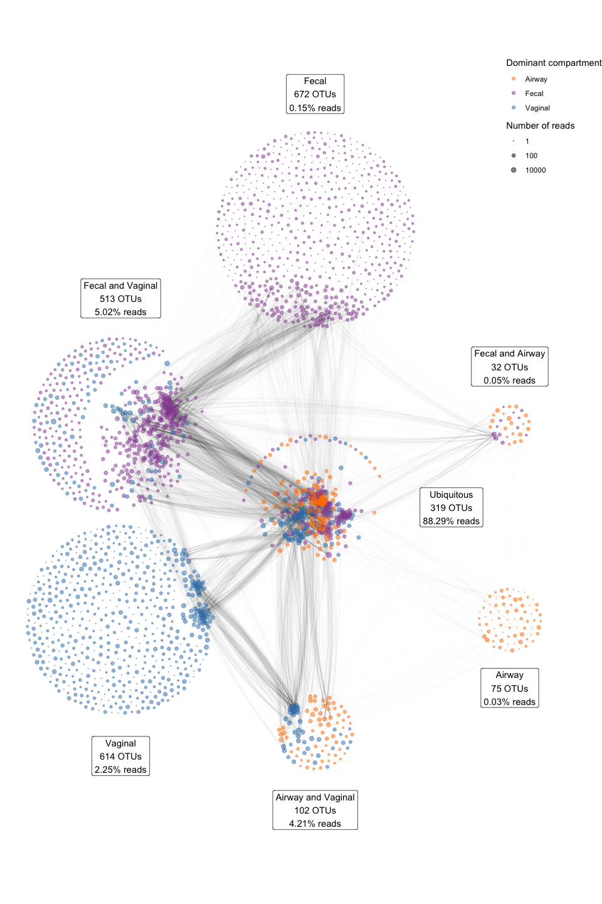

Shannon, PD and unifrac PCoA
----------------------------

    # compute Faith Phylogenetic diversity
    PD <-pd.pl(as(t(otu_table(MBvagdevtrans)), "matrix"), phy_tree(MBvagdevtrans))[1]
    # compute Shannon diversity
    shannon <- plot_richness(MBvagdevtrans, measures="Shannon")

    # add (w) unifrac PCoA results to dataset
    all_uf_d <- distance(MBvagdevtrans, "UniFrac")
    all_uf_o <- ordinate(MBvagdevtrans, "PCoA", all_uf_d)

    all_wuf_d <- distance(MBvagdevtrans, "wUniFrac")
    all_wuf_o <- ordinate(MBvagdevtrans, "PCoA", all_wuf_d)

    plotdat <- plot_ordination(MBvagdevtrans, all_uf_o, color = "set", justDF = T, axes = 1:4) %>% 
      select(1:4) %>% setNames(paste0("all_uf_pc", 1:4))

    plotdat_wuf <- plot_ordination(MBvagdevtrans, all_wuf_o, color = "set", justDF = T, axes = 1:4) %>% 
      select(1:4) %>% setNames(paste0("all_wuf_pc", 1:4))

    SD <- cbind(sample_data(MBvagdevtrans), plotdat,plotdat_wuf, 
                shannon = shannon$data$value, 
                PD = PD$PD) %>% 
      mutate(set = paste(Type,Time, sep = '_') %>%  as.factor(), 
             set = set %>% factor(levels = levels(set)[c(3:5,1:2)],
                                  labels = c('Week 24','Week 36','Birth','Feces 1w','Airway 1w')))
    rownames(SD) <- sample_names(MBvagdevtrans)
    sample_data(MBvagdevtrans) <- SD

Figure S3
---------

Scree plot of variance explained in UniFrac and weighted UniFrac
ordinations on all samples, respectively.

    varExp <- data.frame(cmp = 1:257, PC = paste('PCo',1:257, sep = ''),
                         unifrac = all_uf_o$values$Relative_eig * 100, 
                         wunifrac = all_wuf_o$values$Relative_eig *100)

    varExp %>% 
      gather(mth,VE,unifrac,wunifrac)  %>% 
      filter(cmp<10) %>% 
      ggplot(data = ., aes(PC, VE)) + geom_bar(stat = 'identity') + 
      facet_grid(mth~., scales = 'free') + 
      ylab('Variance Explained (%)')

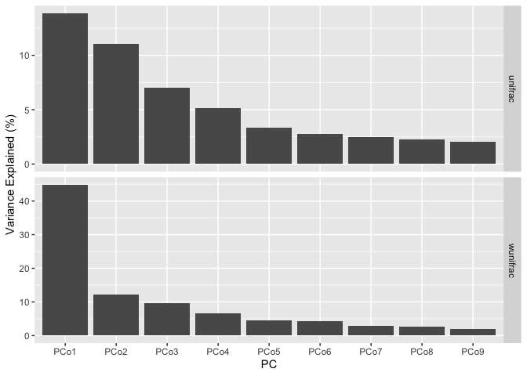

Figure 2
--------

Alpha diversity by A) Faith’s Phylogenetic Diversity (PD) and B) Shannon
diversity of the vaginal (Week 24, Week 36 and Birth), fecal and airway
samples. C) Primary source of variability between vaginal, fecal and
airway samples (PCo1) from ordination by unweighted UniFrac. D) Relative
abundance of the dominant genera.

    ggout0 <- rabuplot(MBvagdevtrans,"set",
                       type="genus",order=TRUE,
                       By_median = FALSE,
                       no_other_type=FALSE,
                       legend_title=NULL, 
                       xlabs =NULL, 
                       main = NULL, 
                       reverse=FALSE
                       ,N_taxa=29,
                       bar_chart = T,
                       order_by = "Time",
                       order_val ="b") + 
      geom_vline(xintercept = 3.5)+
      theme(legend.position = "top",
            legend.text =element_text(size=15) , 
            axis.text.x =element_blank(),
            axis.ticks.x = element_blank(),
            axis.title =element_text(size=18),  
            axis.text.y=element_text(size=14)) + 
      ylab("Mean relative abundance")

    ggout1 <- SD %>% 
      ggplot(data = . , aes(x=set, y=all_uf_pc1, fill=set)) + 
      geom_boxplot(outlier.shape = NA)+ 
      ggbeeswarm::geom_beeswarm(alpha = 0.3) + 
      geom_line(aes(group = dyad), alpha = 0.20)+  
      theme_bw()+ guides(fill=FALSE)+
      scale_fill_brewer(palette="Set1") +
      theme(legend.title=element_blank(),
            axis.ticks.x = element_blank(),
            axis.title.x=element_blank(),
            text=element_text(size=18),
            legend.text =element_text(size=15) ,
            axis.title =element_text(size=18),  
            axis.text.y=element_text(size=14))+
      ylab("Beta diversity - UniFrac PCo1 [13.9%]")+
      geom_vline(xintercept = 3.5)

    ggout1wuf <- SD %>% 
      ggplot(data = . , aes(x=set, y=-all_wuf_pc1, fill=set)) + 
      geom_boxplot(outlier.shape = NA)+ 
      ggbeeswarm::geom_beeswarm(alpha = 0.3) + 
      geom_line(aes(group = dyad), alpha = 0.20)+  
      theme_bw()+ guides(fill=FALSE)+
      scale_fill_brewer(palette="Set1") +
      theme(legend.title=element_blank(),
            axis.ticks.x = element_blank(),
            axis.title.x=element_blank(),
            text=element_text(size=18),
            legend.text =element_text(size=15) ,
            axis.title =element_text(size=18),  
            axis.text.y=element_text(size=14))+
      ylab("Beta diversity - wUniFrac PCo1 [44.1%]")+
      geom_vline(xintercept = 3.5)

    ggout2 <- SD %>% 
      ggplot(data = ., aes(x=set, y=shannon, fill=set)) + 
      geom_boxplot(outlier.shape = NA)+ 
      ggbeeswarm::geom_beeswarm(alpha = 0.3)+ 
      geom_line(aes(group = dyad), alpha = 0.20)+    
      theme_bw()+ guides(fill=FALSE)+
      scale_fill_brewer(palette="Set1") +
      theme(legend.title=element_blank(), 
            axis.title.x=element_blank(), 
            text=element_text(size=18),
            legend.text =element_text(size=15) , 
            axis.text.x =element_blank(),
            axis.ticks.x = element_blank(),
            axis.title =element_text(size=18),  
            axis.text.y=element_text(size=14))+
      ylab("Alpha diversity - Shannon")+
      geom_vline(xintercept = 3.5)

    ggout3 <- SD %>% 
      ggplot(data = ., aes(x=set, y=PD, fill=set))  + 
      geom_boxplot(outlier.shape = NA)+ 
      ggbeeswarm::geom_beeswarm(alpha = 0.3)+ 
      geom_line(aes(group = dyad), alpha = 0.20)+   
      theme_bw()+ guides(fill=FALSE)+
      scale_fill_brewer(palette="Set1") +
      theme(legend.title=element_blank(), 
            axis.title.x=element_blank(), 
            text=element_text(size=18),
            legend.text =element_text(size=15) ,
            axis.title =element_text(size=18),  
            axis.text.y=element_text(size=14),
            axis.ticks.x = element_blank())+
      ylab("Alpha diversity - Faith's PD whole tree")+
      geom_vline(xintercept = 3.5)

    FigA <- ggplot_gtable(ggplot_build(ggout0+ theme(legend.position = "hidden")))
    FigB <- ggplot_gtable(ggplot_build(ggout1))
    FigC <- ggplot_gtable(ggplot_build(ggout2)) #  + scale_y_continuous(breaks = 1:4, labels = paste0("  ", 1:4))
    FigD <- ggplot_gtable(ggplot_build(ggout3))
    FigB$widths[2:3] <-FigA$widths[2:3] 
    FigC$widths[2:3] <-FigD$widths[2:3] 

    legend <- g_legend(ggout0) 
    Fig2 <- ggdraw() + draw_grob(FigA, .5, .1, .5, .45) + 
      draw_grob(FigB, .5, .55, .5, .45) +
      draw_grob(FigD, 0, .55, .5, .45) +
      draw_grob(FigC, 0, .1, .5, .45) +
      draw_grob(legend, 0, 0, 1, .1) +
      draw_line(c(0, .5), c(.1, .1)) +
      draw_line(c(.5, .5), c(.55, .1)) +
      draw_line(c(.5, 1), c(.55, .55)) +
      draw_plot_label(LETTERS[1:4], c(0,0,.5,.5), c(1, .55, 1, .55))
    Fig2

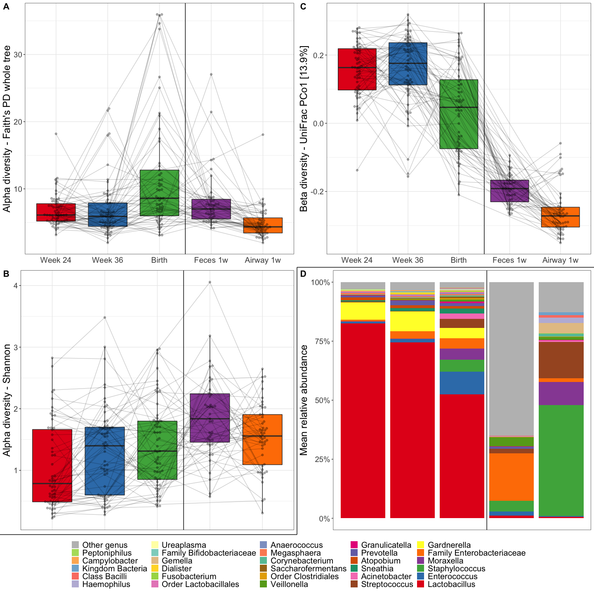

Figure S1
---------

Principal Coordinate 1 of weighted UniFrac distances show a development
towards a more fecal like composition towards the end of pregnancy and
during birth, a similar trend to the unweighted UniFrac ordination used
in Figure 2C.

    ggout1wuf

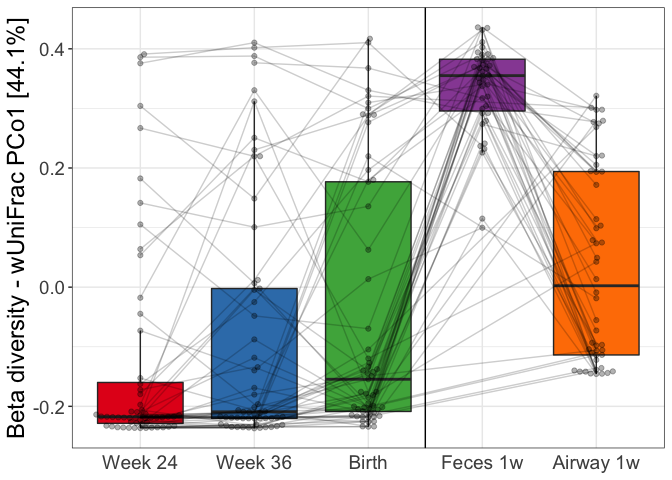

Figure 3
--------

Relative abundances for the top 15 most abundant vaginal taxa at genus
level, colored according to time-point. P-values correspond to
Kruskal-Wallis tests of the relative abundances, with significant values
(P&lt;0.05) bolded. A pseudocount (+1e-06) was added to all abundances
for the log-scale presentation. False discovery rate q-values were
calculated within these top 15 taxa.

    ggout2 <- subset_samples(MBvagdevtrans, Type=='V') %>% 
      rabuplot(phylo_ob = ., predictor = 'Time',type="genus",#order=TRUE,
               By_median = T, no_other_type = TRUE,
               legend_title=NULL, xlabs =NULL, N_taxa=15,
               order_by = "Time",order_val ="b", 
               reverse=TRUE,legend_names=c("Week 24","Week 36","Birth"),
               main = "Genus abundance according to sample time (n=57)", 
               p_adjust = T)

Figure 4
--------

UniFrac ordination of vaginal microbiotas colored according to
time-point and joined within individuals. Ellipses demonstrate the mean
±1 SD.

    # subset on vaginal samples only
    MBvagdevtrans_vag <- MBvagdevtrans %>% subset_samples(Type == 'V') 
    vag_uf_d <- distance(MBvagdevtrans_vag, "UniFrac")
    vag_uf_o <- ordinate(MBvagdevtrans_vag, "PCoA", vag_uf_d)

    # calculate Unifrac Ordination
    PCs <- vag_uf_o$vectors[,1:6]
    colnames(PCs) <- c("PC1_uf","PC2_uf","PC3_uf","PC4_uf","PC5_uf","PC6_uf")
    PCs[,1] <- -1*PCs[,1]
    SDvag <- cbind(sample_data(MBvagdevtrans_vag),PCs)

    # plot it
    ggplot(SDvag, aes(PC1_uf,PC2_uf, color=factor(Time))) + 
      stat_ellipse(aes(x=PC1_uf,y=PC2_uf,color=factor(Time),fill=factor(Time)), geom="polygon",level=0.466,alpha=0.2 )+
      geom_point(size=1.2)+
      geom_path(color="grey",aes(group=factor(dyad)),alpha=0.3)+ 
      theme_bw()  + 
      theme(strip.background = element_blank(),
            legend.key.size = unit(0.6, "cm"),
            legend.position="top", 
            legend.title=element_blank(),
            legend.text=element_text(size=20, face="plain"),
            legend.key = element_blank(),
            text=element_text(size=20), 
            strip.text.x = element_text(size = 20))+ 
      ylab("PCo2 [9.3%]")+xlab("PCo1 [16.8%]")+  
      scale_color_brewer(palette="Set1", labels = c("Week 24 (n=57)   ","Week 36 (n=57)   ","Birth (n=57)"))+
      scale_fill_brewer(palette="Set1",guide = FALSE)+ 
      guides(color = guide_legend(override.aes = list(linetype=0, shape=16,size=8, bg="white")))

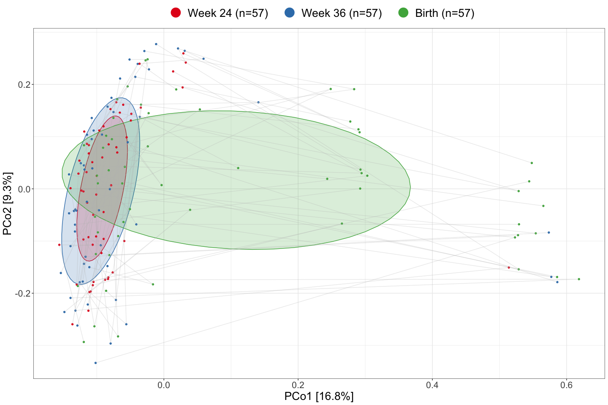

Figure S9A
----------

    SDvag <- SDvag %>%  
      mutate(manclus = ifelse(PC1_uf < .1, "Left", "Middle"), manclus = ifelse(PC1_uf > .4, "Right", manclus))
    rownames(SDvag) <- sample_names(MBvagdevtrans_vag)
    sample_data(MBvagdevtrans_vag) <- SDvag
    LMRpal <- c("#895EC9", "#CC8866", "#71D0CA")

    ggout_01 <- SDvag %>%
      ggplot(aes(PC1_uf,PC2_uf, color=manclus)) + 
      stat_ellipse(aes(x=PC1_uf,y=PC2_uf,color=manclus,fill=manclus), geom="polygon",level=.466 ,alpha=0.2)+ 
      geom_point(size=1.2)+geom_path(color="grey",aes(group=factor(dyad)),alpha=0.3)+ 
      geom_vline(xintercept = c(.1, .4), linetype = "dashed") +
      theme_bw() +
      theme(strip.background = element_blank(),legend.key.size = unit(0.6, "cm"),legend.position="top", legend.title=element_blank(),legend.text=element_text(size=20, face="plain"),legend.key = element_blank(),text=element_text(size=20), strip.text.x = element_text(size = 20))+ 
      ylab("PCo2 [9.3%]")+xlab("PCo1 [16.8%]")+ 
      scale_color_manual(values = LMRpal)+ 
      scale_fill_manual(values = LMRpal,guide = FALSE)+ 
      guides(color = guide_legend(override.aes = list(linetype=0, shape=16,size=8, bg="white")))
    ggout_01

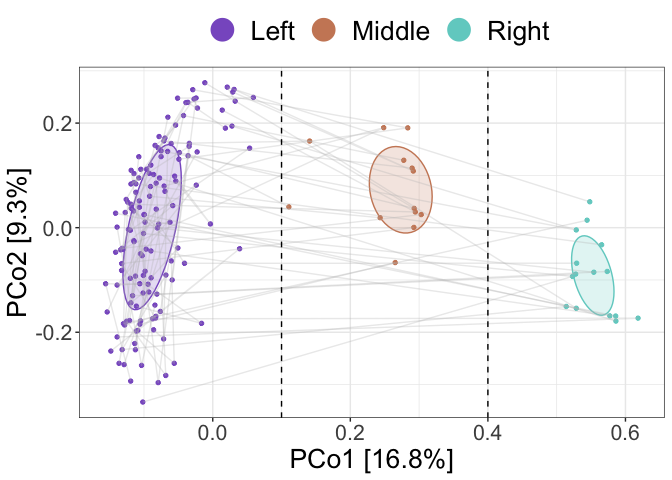

Figure S9B
----------

    ggout_02 <- rabuplot(MBvagdevtrans_vag, "manclus",
                         type="genus",order=TRUE,By_median = T,
                         no_other_type=TRUE,legend_title=NULL, 
                         xlabs =NULL, N_taxa=30, order_by = "Time",
                         order_val ="b", reverse=TRUE,
                         main = "Clustering based on UniFrac PCo1", 
                         p_adjust = T, colors = LMRpal)

    ggout_02

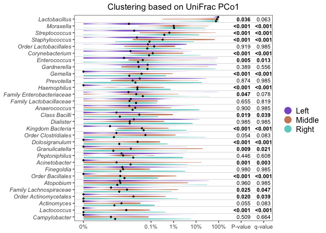

Figure S9C
----------

    bugdata <- data.frame(OTU = taxa_names(MBvagdevtrans), 
                          mra = taxa_sums(MBvagdevtrans %>% transform_sample_counts(function(x) x/sum(x)))/nsamples(MBvagdevtrans),
                          presence = rowMeans(otu_table(MBvagdevtrans) != 0))
    indi <- multipatt(MBvagdevtrans_vag %>% 
                        subset_samples(!is.na(manclus)) %>% 
                        transform_sample_counts(function(x) x/sum(x)) %>% 
                        otu_table %>% as("matrix") %>% t %>% data.frame,
                      get_variable(MBvagdevtrans_vag %>% 
                                     subset_samples(!is.na(manclus)), "manclus"),
                      control=how(nperm = 999),
                      print.perm = T)

    indires <- indi %>% summary.multipatt2(indvalcomp = T, At = .6, Bt = .6)

    ## 
    ##  Multilevel pattern analysis
    ##  ---------------------------
    ## 
    ##  Association function: IndVal.g
    ##  Significance level (alpha): 0.05
    ##  Minimum positive predictive value (At): 0.6
    ##  Minimum sensitivity (Bt): 0.6
    ## 
    ##  Total number of species: 2327
    ##  Selected number of species: 27 
    ##  Number of species associated to 1 group: 9 
    ##  Number of species associated to 2 groups: 18 
    ## 
    ##  List of species associated to each combination: 
    ## 
    ##  Group Middle  #sps.  7 
    ##                               A      B  stat p.value    
    ## Staphylococcus_OTU6301   0.8263 1.0000 0.909   0.001 ***
    ## Staphylococcus_OTU1      0.8768 0.9231 0.900   0.001 ***
    ## Kingdom_Bacteria_OTU553  0.9383 0.7692 0.850   0.001 ***
    ## Staphylococcus_OTU6213   0.8683 0.7692 0.817   0.003 ** 
    ## Order_Bacillales_OTU5542 0.8883 0.6923 0.784   0.001 ***
    ## Order_Bacillales_OTU6310 0.6731 0.6154 0.644   0.001 ***
    ## Streptococcus_OTU1959    0.6672 0.6154 0.641   0.002 ** 
    ## 
    ##  Group Right  #sps.  2 
    ##                              A      B  stat p.value    
    ## Ureaplasma_OTU92        0.8504 0.7333 0.790   0.001 ***
    ## Kingdom_Bacteria_OTU800 1.0000 0.6000 0.775   0.001 ***
    ## 
    ##  Group Middle+Right  #sps.  18 
    ##                             A      B  stat p.value    
    ## Staphylococcus_OTU3539 0.9082 1.0000 0.953   0.002 ** 
    ## Moraxella_OTU6         0.8889 0.9643 0.926   0.001 ***
    ## Streptococcus_OTU6248  0.8638 0.9286 0.896   0.005 ** 
    ## Haemophilus_OTU11      0.8850 0.8571 0.871   0.001 ***
    ## Corynebacterium_OTU49  0.9637 0.7143 0.830   0.001 ***
    ## Streptococcus_OTU5603  0.9060 0.7143 0.804   0.001 ***
    ## Gemella_OTU13          0.8077 0.7857 0.797   0.009 ** 
    ## Streptococcus_OTU5     0.9263 0.6786 0.793   0.001 ***
    ## Corynebacterium_OTU15  0.8230 0.7143 0.767   0.003 ** 
    ## Streptococcus_OTU6662  0.9461 0.6071 0.758   0.001 ***
    ## Granulicatella_OTU4437 0.8661 0.6429 0.746   0.005 ** 
    ## Class_Bacilli_OTU6711  0.8892 0.6071 0.735   0.003 ** 
    ## Streptococcus_OTU5561  0.7866 0.6786 0.731   0.003 ** 
    ## Corynebacterium_OTU254 0.8699 0.6071 0.727   0.040 *  
    ## Pelomonas_OTU66        0.8032 0.6429 0.719   0.024 *  
    ## Streptococcus_OTU6358  0.8226 0.6071 0.707   0.006 ** 
    ## Dolosigranulum_OTU28   0.8139 0.6071 0.703   0.003 ** 
    ## Streptococcus_OTU6229  0.7979 0.6071 0.696   0.001 ***
    ## ---
    ## Signif. codes:  0 '***' 0.001 '**' 0.01 '*' 0.05 '.' 0.1 ' ' 1

    indiplot <- indires %>% lapply(function(x) mutate(x, OTU = rownames(x))) %>% bind_rows(.id = "Group") %>%
      rename("Positive_predictive_value" = "A", "Sensitivity" = "B", "Combined_Statistic" = "stat") %>%
      left_join(bugdata) %>%
      arrange(Group, desc(Combined_Statistic)) %>% 
      mutate(OTU = factor(OTU) %>% fct_inorder %>% fct_rev)

    ggout_05 <- indiplot %>% gather(key, value, Positive_predictive_value:Combined_Statistic) %>%
      mutate(key = factor(key, levels = c("Positive_predictive_value", "Sensitivity", "Combined_Statistic"))) %>%
      ggplot(aes(value, OTU, fill = key)) + 
      geom_barh(stat = "identity", position = "dodgev", width = .8) +
      annotate("rect", fill = "white", xmin = 1, ymin = -Inf, xmax = Inf, ymax = Inf) +
      geom_text(aes(label = sprintf("%.2f", presence)), size = 2.5, fontface = "plain", x = 1.2, data = . %>% filter(key == "Combined_Statistic")) +
      geom_text(aes(label = sprintf("%.2e", mra)), size = 2.5, fontface = "plain", x = 1.4, data = . %>% filter(key == "Combined_Statistic")) +
      facet_grid(Group~., scales = "free_y", space = "free") +
      scale_fill_manual(name = NULL, values = c("#ABBEE3", "#E2A7BF", "black")) +
      scale_x_continuous(breaks = c(0:7/5), labels = c(0:5/5, "Presence", "MRA"), limits = c(0,1.5)) +
      ylab("Indicator OTU") +
      xlab("Indicator value") +
      theme(axis.text.x = element_text(size = 7))

    ggout_05

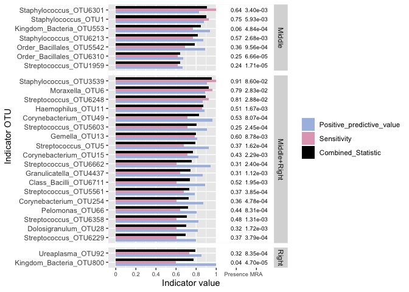

Figure 5
--------

Transfer statistics

    phy1 <- subset_samples(MBvagdevtrans, Time == 'b' & delivery=='Normal')
    phy2 <- subset_samples(MBvagdevtrans, Type == 'F')
    phy3 <- subset_samples(MBvagdevtrans, Type == 'T')
    res2F <- randpermutationTransferStats(phy1, phy2, 'dyad', nperm = 3)

    ## [1]  36 536

    res2T <- randpermutationTransferStats(phy1, phy3, 'dyad', nperm = 3)

    ## [1]  45 346

    truncatevector <- function(Genus,relabu, ct = 20){
      df <- data.frame(Genus = as.character(Genus), relabu) %>% 
        group_by(Genus) %>% 
        summarise(sm = sum(relabu)) %>% 
        ungroup() %>% 
        mutate(rnk = rank(sm), 
               rnk = max(rnk) - rnk + 1) %>% 
        arrange(rnk)
      
      Genus2 <- Genus
      Genus2[Genus %in% df$Genus[df$rnk>(ct-1)]] <- 'other'
      # print(df$Genus[1:(ct-1)])
      Genus2 <- factor(Genus2, levels = c(as.character(df$Genus[1:(ct-1)]),'other'))
      # print(Genus2)
      return(Genus2)
    }

    # dig out the data.frames with the statistics in
    DF <- rbind(data.frame(res2F[[1]], comparison = 'fecal'),
                data.frame(res2T[[1]], comparison = 'trach')) %>% 
      mutate(nC = 100*(n11 + n01) / (n11+n00 +n10 +n01), 
             estimate = Fisher_estimatetr, 
             p.value = Fisher_p.value, 
             Genus2 = truncatevector(Genus %>% as.character(),abuMrel,ct = 20)) 

    levels(DF$comparison) <- c('Vaginal (birth) to gut','Vaginal (birth) to airways')
    cols  <- c(brewer.pal(8,"Set1"), brewer.pal(7,"Dark2"),brewer.pal(4,"Set2"),"gray") 

    pvbrk <- c(0.0025,0.01,0.05,0.1,0.2, 0.5)

    g1 <- ggplot(data = DF,aes(x = estimate,y = -log10(p.value),color = Genus2,label = otu,size = nC))+
      geom_point() + 
      facet_wrap(~comparison) + 
      ggrepel::geom_text_repel(color = 'black',data = DF[DF$p.value<0.05,],size = 5) + 
      geom_hline(yintercept = -log10(0.05)) + theme_bw() + 
      scale_color_manual(values = cols) + 
      theme(legend.position = 'bottom', strip.background = element_blank(),
            legend.title=element_text(size = 18),
            strip.text.x = element_text(size = 18),
            legend.text=element_text(size=16), 
            axis.text = element_text(size = 12), 
            axis.title = element_text(size = 16)) + 
      xlab('Odds ratio') + ylab('P-value') + 
      guides(color = guide_legend(title=NULL,override.aes = list(size = 5)),
             size = guide_legend(title = '%children',direction = "vertical")) +
      scale_x_log10(breaks = c(0.01,0.1,1,10,100), labels = c('.01','.1','1','10','100') ) + 
      scale_size_continuous(limits = c(0,100)) + 
      scale_y_continuous(breaks = -log10(pvbrk), labels = pvbrk )
    g1

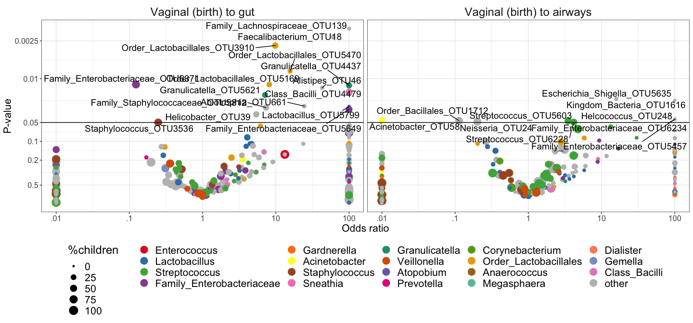

Figure S10
----------

    nsamples_presense <- MBvagdevtrans %>% 
      subset_samples((Type == 'V' & Time=='b') | Type == 'F' | Type=='T')  %>% 
      transform_sample_counts(function(x) (x>0) + 0) %>% taxa_sums()
    nsamples_presense <- nsamples_presense[nsamples_presense>144*0.1]
    length(nsamples_presense)

    ## [1] 325

    AA <- DF %>% 
      filter(otu %in% names(nsamples_presense)) %>% 
      mutate(estimate = Fisher_estimate %>% truncateZerosInf(trc = 10)) %>% 
      select(otu,comparison,estimate) %>% 
      spread(comparison,estimate)

    colnames(AA)[2:3] <- c('fecal','airways')

    ic1 <- rownames(tax_table(MBvagdevtrans)) %in% AA$otu
    # select which of the OTU's (in total) to include in the plotting
    xOTU <- otu_table(MBvagdevtrans)
    ic2 <- apply(xOTU>1,1,sum) > dim(xOTU)[2]*0.1
    ictaxa <- ic1 | ic2 
    x <- subset_taxa(MBvagdevtrans,ictaxa)
    # extract tree and taxonomic info
    TREE <- phy_tree(x)
    TXtab <- as.data.frame(tax_table(x))

    # merge on inferential stats
    AA <- merge(TXtab,AA,by.x = 'row.names',by.y = 'otu')

    # initiale tree
    g3 <- ggtree(TREE,layout = 'circular',branch.length="none")
    # change 'left side' labels
    g3$data$label2 <- g3$data$label
    g3$data$label2 <- paste('OTU', 
                            unlist(lapply(as.list(g3$data$label2), function(x){strsplit(x,'_OTU')[[1]][2]})),
                            '_',
                            unlist(lapply(as.list(g3$data$label2), function(x){strsplit(x,'_OTU')[[1]][1]})),
                            sep = '')

    g3 <- g3 %<+%  AA + 
      #geom_tiplab(aes(x = x+2,label=Order,angle=angle,size =3)) +
      #geom_hilight(node=333, fill="darkgreen", alpha=.6) + 
      #geom_hilight(node=357, fill="gray10", alpha=.2) +
      #geom_hilight(node=348, fill="gray10", alpha=.2) +
      #geom_hilight(node=655, fill="gray10", alpha=.2) +
      #geom_hilight(node=336, fill="gray10", alpha=.2) +
      #geom_hilight(node=331, fill="gray10", alpha=.2) +
      #geom_hilight(node=476, fill="gray10", alpha=.2) +
      #geom_hilight(node=609, fill="gray10", alpha=.2) +
      geom_tiplab(aes(x = x+2,label=label,angle=angle,size =3, subset = ((angle<90 | angle>270) & isTip))) +
      geom_tiplab(aes(x = x+2,label=label2,angle=angle+180,size =3, subset = ((angle>=90 & angle<=270) & isTip)), hjust =1) +
      geom_tippoint(aes(fill = log10(fecal),subset = !is.na(fecal)), shape=21,size = 5 )  +
      geom_tippoint(aes(x = x+1, fill = log10(airways),subset = !is.na(airways)), shape=22,size = 5 ) +
      #geom_line(aes(x+3,y))+
      scale_fill_gradient2(low = 'red',high = 'darkgreen',midpoint = 0,mid = 'white',na.value = 'grey95',name = 'log(OR)') +  
      #geom_text(aes(label=label,angle=angle), hjust=-.5) +
      #geom_text(aes(label =node)) + 
      theme(legend.position="right",legend.title=element_blank()) 

    g3 + xlim(c(0,60)) +guides(size =  F) +  theme(legend.position = c(0.80,0.7))

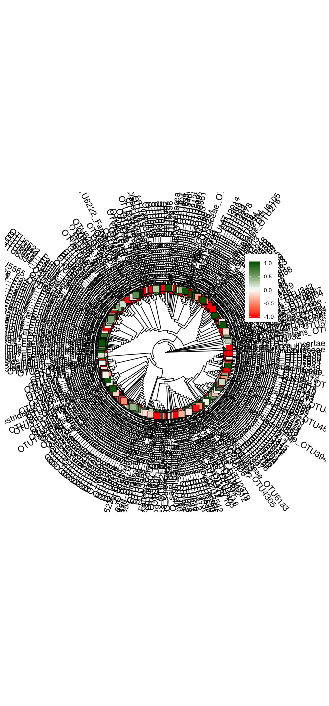

Table S4
--------

Summary statistics (median (25% quartile; 75% quartile)) for compartment
and sampling time point. N = number of samples, library size = number of
reads, \#OTUs = number of observed OTUs, PD = Faith’s Phylogenetic
Diversity, Shannon = Shannon diversity.

    SD <- sample_data(MBvagdevtrans)
    otutab <- MBvagdevtrans %>% otu_table() %>% t()

    Xlong <- cbind(rwname = rownames(SD),otutab) %>% 
      data.frame() %>% 
      mutate(rwname = rwname %>% as.character()) %>% 
      gather(otu,count,-rwname) %>% 
      mutate(count = count %>% as.numeric())

    # get number of OTUs, libsize for each dyad

    Xsum1 <- Xlong %>% 
      group_by(rwname) %>% 
      summarise(nOTU = sum(count>0), 
                libsize = sum(count))

    TabS4 <- cbind(SD,Xsum1) %>% 
      select(set,nOTU,libsize,shannon,PD) %>% 
      gather(var,val,-set) %>% 
      group_by(set,var) %>% 
      summarize(n_samples = n(), 
                mdn = median(val),
                q25 = quantile(val)[2],
                q75 = quantile(val)[4])

    knitr::kable(TabS4, digits = 2, caption = 'Table S4 - Summary statistics (median (25% quartile; 75% quartile)) for compartment and sampling time point. N = number of samples, library size = number of reads, #OTUs = number of observed OTUs, PD = Faith’s Phylogenetic Diversity, Shannon = Shannon diversity.
    ')

<table>
<caption>Table S4 - Summary statistics (median (25% quartile; 75% quartile)) for compartment and sampling time point. N = number of samples, library size = number of reads, #OTUs = number of observed OTUs, PD = Faith’s Phylogenetic Diversity, Shannon = Shannon diversity.</caption>
<thead>
<tr class="header">
<th style="text-align: left;">set</th>
<th style="text-align: left;">var</th>
<th style="text-align: right;">n_samples</th>
<th style="text-align: right;">mdn</th>
<th style="text-align: right;">q25</th>
<th style="text-align: right;">q75</th>
</tr>
</thead>
<tbody>
<tr class="odd">
<td style="text-align: left;">Week 24</td>
<td style="text-align: left;">libsize</td>
<td style="text-align: right;">56</td>
<td style="text-align: right;">41678.00</td>
<td style="text-align: right;">30183.00</td>
<td style="text-align: right;">53283.50</td>
</tr>
<tr class="even">
<td style="text-align: left;">Week 24</td>
<td style="text-align: left;">nOTU</td>
<td style="text-align: right;">56</td>
<td style="text-align: right;">92.50</td>
<td style="text-align: right;">68.75</td>
<td style="text-align: right;">129.00</td>
</tr>
<tr class="odd">
<td style="text-align: left;">Week 24</td>
<td style="text-align: left;">PD</td>
<td style="text-align: right;">56</td>
<td style="text-align: right;">6.10</td>
<td style="text-align: right;">5.19</td>
<td style="text-align: right;">7.79</td>
</tr>
<tr class="even">
<td style="text-align: left;">Week 24</td>
<td style="text-align: left;">shannon</td>
<td style="text-align: right;">56</td>
<td style="text-align: right;">0.79</td>
<td style="text-align: right;">0.49</td>
<td style="text-align: right;">1.66</td>
</tr>
<tr class="odd">
<td style="text-align: left;">Week 36</td>
<td style="text-align: left;">libsize</td>
<td style="text-align: right;">57</td>
<td style="text-align: right;">46028.00</td>
<td style="text-align: right;">27361.00</td>
<td style="text-align: right;">66719.00</td>
</tr>
<tr class="even">
<td style="text-align: left;">Week 36</td>
<td style="text-align: left;">nOTU</td>
<td style="text-align: right;">57</td>
<td style="text-align: right;">93.00</td>
<td style="text-align: right;">72.00</td>
<td style="text-align: right;">119.00</td>
</tr>
<tr class="odd">
<td style="text-align: left;">Week 36</td>
<td style="text-align: left;">PD</td>
<td style="text-align: right;">57</td>
<td style="text-align: right;">5.90</td>
<td style="text-align: right;">4.41</td>
<td style="text-align: right;">7.91</td>
</tr>
<tr class="even">
<td style="text-align: left;">Week 36</td>
<td style="text-align: left;">shannon</td>
<td style="text-align: right;">57</td>
<td style="text-align: right;">1.40</td>
<td style="text-align: right;">0.60</td>
<td style="text-align: right;">1.70</td>
</tr>
<tr class="odd">
<td style="text-align: left;">Birth</td>
<td style="text-align: left;">libsize</td>
<td style="text-align: right;">57</td>
<td style="text-align: right;">40205.00</td>
<td style="text-align: right;">34873.00</td>
<td style="text-align: right;">64116.00</td>
</tr>
<tr class="even">
<td style="text-align: left;">Birth</td>
<td style="text-align: left;">nOTU</td>
<td style="text-align: right;">57</td>
<td style="text-align: right;">84.00</td>
<td style="text-align: right;">73.00</td>
<td style="text-align: right;">139.00</td>
</tr>
<tr class="odd">
<td style="text-align: left;">Birth</td>
<td style="text-align: left;">PD</td>
<td style="text-align: right;">57</td>
<td style="text-align: right;">8.59</td>
<td style="text-align: right;">5.99</td>
<td style="text-align: right;">12.80</td>
</tr>
<tr class="even">
<td style="text-align: left;">Birth</td>
<td style="text-align: left;">shannon</td>
<td style="text-align: right;">57</td>
<td style="text-align: right;">1.31</td>
<td style="text-align: right;">0.85</td>
<td style="text-align: right;">1.80</td>
</tr>
<tr class="odd">
<td style="text-align: left;">Feces 1w</td>
<td style="text-align: left;">libsize</td>
<td style="text-align: right;">39</td>
<td style="text-align: right;">44160.00</td>
<td style="text-align: right;">24853.00</td>
<td style="text-align: right;">64037.50</td>
</tr>
<tr class="even">
<td style="text-align: left;">Feces 1w</td>
<td style="text-align: left;">nOTU</td>
<td style="text-align: right;">39</td>
<td style="text-align: right;">102.00</td>
<td style="text-align: right;">77.50</td>
<td style="text-align: right;">135.00</td>
</tr>
<tr class="odd">
<td style="text-align: left;">Feces 1w</td>
<td style="text-align: left;">PD</td>
<td style="text-align: right;">39</td>
<td style="text-align: right;">7.00</td>
<td style="text-align: right;">5.53</td>
<td style="text-align: right;">8.45</td>
</tr>
<tr class="even">
<td style="text-align: left;">Feces 1w</td>
<td style="text-align: left;">shannon</td>
<td style="text-align: right;">39</td>
<td style="text-align: right;">1.84</td>
<td style="text-align: right;">1.46</td>
<td style="text-align: right;">2.24</td>
</tr>
<tr class="odd">
<td style="text-align: left;">Airway 1w</td>
<td style="text-align: left;">libsize</td>
<td style="text-align: right;">48</td>
<td style="text-align: right;">40743.50</td>
<td style="text-align: right;">25511.75</td>
<td style="text-align: right;">55810.00</td>
</tr>
<tr class="even">
<td style="text-align: left;">Airway 1w</td>
<td style="text-align: left;">nOTU</td>
<td style="text-align: right;">48</td>
<td style="text-align: right;">111.00</td>
<td style="text-align: right;">72.75</td>
<td style="text-align: right;">132.50</td>
</tr>
<tr class="odd">
<td style="text-align: left;">Airway 1w</td>
<td style="text-align: left;">PD</td>
<td style="text-align: right;">48</td>
<td style="text-align: right;">4.34</td>
<td style="text-align: right;">3.43</td>
<td style="text-align: right;">5.68</td>
</tr>
<tr class="even">
<td style="text-align: left;">Airway 1w</td>
<td style="text-align: left;">shannon</td>
<td style="text-align: right;">48</td>
<td style="text-align: right;">1.56</td>
<td style="text-align: right;">1.09</td>
<td style="text-align: right;">1.91</td>
</tr>
</tbody>
</table>

Table S5
--------

Unique OTUs found in vaginal birth samples, but not in pregnancy week 24
or 36 samples (OTUs identified in ≥5 samples).

    SD$rwname <- rownames(SD)

    xx <- Xlong %>% 
      left_join(data.frame(SD), by = 'rwname') %>% 
      filter(Type=='V' & Time=='b') %>% 
      group_by(dyad) %>% 
      mutate(libsize = sum(count)) %>% 
      ungroup() %>% 
      mutate(relabu= count / libsize) %>% 
      group_by(otu) %>% 
      summarise(meanrelabu = mean(relabu), 
                nreads = sum(count))

    TabS5 <- Xlong %>% 
      left_join(data.frame(SD), by = 'rwname') %>% 
      filter(Type=='V') %>% 
      group_by(otu,set) %>% 
      summarize(npos = sum(count>0)) %>% 
      spread(set,npos) %>% 
      filter(Birth>4 & `Week 24`==0 & `Week 36`==0) %>% 
      arrange(desc(Birth)) %>% 
      rename(Npos = Birth) %>% 
      select(otu,Npos) %>% 
      left_join(xx, by = 'otu')

    knitr::kable(TabS5, caption = 'Table S5 - Unique OTUs found in vaginal birth samples, but not in pregnancy week 24 or 36 samples (OTUs identified in ≥5 samples)')  

<table>
<caption>Table S5 - Unique OTUs found in vaginal birth samples, but not in pregnancy week 24 or 36 samples (OTUs identified in ≥5 samples)</caption>
<thead>
<tr class="header">
<th style="text-align: left;">otu</th>
<th style="text-align: right;">Npos</th>
<th style="text-align: right;">meanrelabu</th>
<th style="text-align: right;">nreads</th>
</tr>
</thead>
<tbody>
<tr class="odd">
<td style="text-align: left;">Streptococcus_OTU6228</td>
<td style="text-align: right;">14</td>
<td style="text-align: right;">0.0000383</td>
<td style="text-align: right;">81</td>
</tr>
<tr class="even">
<td style="text-align: left;">Moraxella_OTU4678</td>
<td style="text-align: right;">13</td>
<td style="text-align: right;">0.0000127</td>
<td style="text-align: right;">28</td>
</tr>
<tr class="odd">
<td style="text-align: left;">Kingdom_Bacteria_OTU553</td>
<td style="text-align: right;">12</td>
<td style="text-align: right;">0.0001221</td>
<td style="text-align: right;">245</td>
</tr>
<tr class="even">
<td style="text-align: left;">Moraxella_OTU3511</td>
<td style="text-align: right;">11</td>
<td style="text-align: right;">0.0000074</td>
<td style="text-align: right;">14</td>
</tr>
<tr class="odd">
<td style="text-align: left;">Streptococcus_OTU6224</td>
<td style="text-align: right;">10</td>
<td style="text-align: right;">0.0000156</td>
<td style="text-align: right;">33</td>
</tr>
<tr class="even">
<td style="text-align: left;">Moraxella_OTU4650</td>
<td style="text-align: right;">8</td>
<td style="text-align: right;">0.0000071</td>
<td style="text-align: right;">16</td>
</tr>
<tr class="odd">
<td style="text-align: left;">Family_Chitinophagaceae_OTU990</td>
<td style="text-align: right;">7</td>
<td style="text-align: right;">0.0000248</td>
<td style="text-align: right;">64</td>
</tr>
<tr class="even">
<td style="text-align: left;">Order_Bacillales_OTU3316</td>
<td style="text-align: right;">7</td>
<td style="text-align: right;">0.0000474</td>
<td style="text-align: right;">121</td>
</tr>
<tr class="odd">
<td style="text-align: left;">Streptococcus_OTU5596</td>
<td style="text-align: right;">7</td>
<td style="text-align: right;">0.0000813</td>
<td style="text-align: right;">186</td>
</tr>
<tr class="even">
<td style="text-align: left;">Class_Bacilli_OTU4895</td>
<td style="text-align: right;">5</td>
<td style="text-align: right;">0.0000162</td>
<td style="text-align: right;">38</td>
</tr>
<tr class="odd">
<td style="text-align: left;">Moraxella_OTU6681</td>
<td style="text-align: right;">5</td>
<td style="text-align: right;">0.0000052</td>
<td style="text-align: right;">9</td>
</tr>
</tbody>
</table>

Table S7
--------

Weighted transfer Ratios (WR) from vaginal birth microbiome to fecal-
and airway microbiome age one week, based on all data as well as
rarefied to lowest common depth (2325 reads per sample). notu = number
of test-able otus for each analysis, pv = permutation p-value for WR
statistics (999 permutations).

    MBvagdevtransrare <- rarefy_even_depth(MBvagdevtrans,sample.size = 2325)
    phy1rare <- subset_samples(MBvagdevtransrare, Time == 'b' & delivery=='Normal')
    phy2rare <- subset_samples(MBvagdevtransrare, Type == 'F')
    phy3rare <- subset_samples(MBvagdevtransrare, Type == 'T')

    res2Frare <- randpermutationTransferStats(phy1rare, phy2rare, 'dyad', nperm = 3)

    ## [1]  36 225

    res2Trare <- randpermutationTransferStats(phy1rare, phy3rare, 'dyad', nperm = 3)

    ## [1]  45 176

    tb_transfer <- rbind(data.frame(compartment = 'Fecal', rarefy = 'No',getInferenceWeightedRatio(res2F)),
                         data.frame(compartment = 'Trach', rarefy = 'No',getInferenceWeightedRatio(res2T)),
                         data.frame(compartment = 'Fecal', rarefy = 'Yes',getInferenceWeightedRatio(res2Frare)),
                         data.frame(compartment = 'Trach', rarefy = 'Yes',getInferenceWeightedRatio(res2Trare)))

    tb_transfer %>% select(-permmedian) %>% 
      knitr::kable(x = ., caption = 'Weighted transfer Ratios (WR) from vaginal birth microbiome to fecal- and airway microbiome age one week, based on all data as well as rarefied to lowest common depth (2325 reads per sample). notu = number of test-able otus for each analysis, pv = permutation p-value for WR statistics (999 permutations)', digits = 2) 

<table>
<caption>Weighted transfer Ratios (WR) from vaginal birth microbiome to fecal- and airway microbiome age one week, based on all data as well as rarefied to lowest common depth (2325 reads per sample). notu = number of test-able otus for each analysis, pv = permutation p-value for WR statistics (999 permutations)</caption>
<thead>
<tr class="header">
<th style="text-align: left;">compartment</th>
<th style="text-align: left;">rarefy</th>
<th style="text-align: right;">modelratio</th>
<th style="text-align: right;">ntest</th>
<th style="text-align: right;">pv</th>
<th style="text-align: right;">SElgratio</th>
</tr>
</thead>
<tbody>
<tr class="odd">
<td style="text-align: left;">Fecal</td>
<td style="text-align: left;">No</td>
<td style="text-align: right;">2.69</td>
<td style="text-align: right;">536</td>
<td style="text-align: right;">0</td>
<td style="text-align: right;">0.18</td>
</tr>
<tr class="even">
<td style="text-align: left;">Trach</td>
<td style="text-align: left;">No</td>
<td style="text-align: right;">2.25</td>
<td style="text-align: right;">346</td>
<td style="text-align: right;">0</td>
<td style="text-align: right;">0.13</td>
</tr>
<tr class="odd">
<td style="text-align: left;">Fecal</td>
<td style="text-align: left;">Yes</td>
<td style="text-align: right;">3.89</td>
<td style="text-align: right;">225</td>
<td style="text-align: right;">0</td>
<td style="text-align: right;">0.52</td>
</tr>
<tr class="even">
<td style="text-align: left;">Trach</td>
<td style="text-align: left;">Yes</td>
<td style="text-align: right;">2.77</td>
<td style="text-align: right;">176</td>
<td style="text-align: right;">0</td>
<td style="text-align: right;">0.37</td>
</tr>
</tbody>
</table>

Table S8
--------

Beta-diversity comparison between vaginal microbiotas at birth and
1-week fecal and 1-week airway in children born by vaginal delivery. P
values and distances of matching and non-matching mother-child pairs are
computed by random permutation (n = 999)

    nperm <- 999
    Dmethod <-  c('binomial', 'jsd', 'jaccard', 'bray','binary', 'wunifrac', 'unifrac')
    compartment <- c('F','T')

    res <- c()
    for (cmp in compartment){
      
      x12 <- subset_samples(MBvagdevtrans,((Type=='V' & Time=='b') | Type==cmp) & delivery=='Normal')
      dyad <- sample_data(x12)$dyad
      tb <- dyad %>% table() 
      x12 <- subset_samples(x12,dyad %in% names(tb[tb==2]))
      x12 <- merge_phyloseq(subset_samples(x12,Type=='V'),subset_samples(x12,Type==cmp))  # this one to make sure that they are sorted according to compartment. 
      dyad <- sample_data(x12)$dyad
      
      for (dist_method  in Dmethod){
        # get distance between pairs
        D12 <- as.matrix(distance(x12,method = dist_method))
        
        res <- rbind(res,
                     data.frame(compartment = cmp, method = dist_method,
                                permDistpair(D12,dyad, nperm = nperm)))
      }
    }

    knitr::kable(res, digits = 3, 
                 caption = 'Beta-diversity comparison between vaginal microbiotas at birth and 1-week fecal and 1-week airway in children born by vaginal delivery. P values and distances of matching and non-matching mother-child pairs are computed by random permutation (n = 999)')

<table>
<caption>Beta-diversity comparison between vaginal microbiotas at birth and 1-week fecal and 1-week airway in children born by vaginal delivery. P values and distances of matching and non-matching mother-child pairs are computed by random permutation (n = 999)</caption>
<thead>
<tr class="header">
<th style="text-align: left;">compartment</th>
<th style="text-align: left;">method</th>
<th style="text-align: right;">meandist</th>
<th style="text-align: right;">sdmeandist</th>
<th style="text-align: right;">meanrandomdist</th>
<th style="text-align: right;">sdmeanrandomdist</th>
<th style="text-align: right;">pv</th>
</tr>
</thead>
<tbody>
<tr class="odd">
<td style="text-align: left;">F</td>
<td style="text-align: left;">binomial</td>
<td style="text-align: right;">176.397</td>
<td style="text-align: right;">67.921</td>
<td style="text-align: right;">179.116</td>
<td style="text-align: right;">70.807</td>
<td style="text-align: right;">0.019</td>
</tr>
<tr class="even">
<td style="text-align: left;">F</td>
<td style="text-align: left;">jsd</td>
<td style="text-align: right;">0.649</td>
<td style="text-align: right;">0.071</td>
<td style="text-align: right;">0.664</td>
<td style="text-align: right;">0.046</td>
<td style="text-align: right;">0.025</td>
</tr>
<tr class="odd">
<td style="text-align: left;">F</td>
<td style="text-align: left;">jaccard</td>
<td style="text-align: right;">0.982</td>
<td style="text-align: right;">0.039</td>
<td style="text-align: right;">0.990</td>
<td style="text-align: right;">0.026</td>
<td style="text-align: right;">0.089</td>
</tr>
<tr class="even">
<td style="text-align: left;">F</td>
<td style="text-align: left;">bray</td>
<td style="text-align: right;">0.968</td>
<td style="text-align: right;">0.069</td>
<td style="text-align: right;">0.981</td>
<td style="text-align: right;">0.042</td>
<td style="text-align: right;">0.044</td>
</tr>
<tr class="odd">
<td style="text-align: left;">F</td>
<td style="text-align: left;">binary</td>
<td style="text-align: right;">0.902</td>
<td style="text-align: right;">0.041</td>
<td style="text-align: right;">0.910</td>
<td style="text-align: right;">0.034</td>
<td style="text-align: right;">0.012</td>
</tr>
<tr class="even">
<td style="text-align: left;">F</td>
<td style="text-align: left;">wunifrac</td>
<td style="text-align: right;">0.612</td>
<td style="text-align: right;">0.089</td>
<td style="text-align: right;">0.617</td>
<td style="text-align: right;">0.090</td>
<td style="text-align: right;">0.244</td>
</tr>
<tr class="odd">
<td style="text-align: left;">F</td>
<td style="text-align: left;">unifrac</td>
<td style="text-align: right;">0.810</td>
<td style="text-align: right;">0.062</td>
<td style="text-align: right;">0.813</td>
<td style="text-align: right;">0.062</td>
<td style="text-align: right;">0.204</td>
</tr>
<tr class="even">
<td style="text-align: left;">T</td>
<td style="text-align: left;">binomial</td>
<td style="text-align: right;">107.372</td>
<td style="text-align: right;">37.807</td>
<td style="text-align: right;">108.774</td>
<td style="text-align: right;">37.610</td>
<td style="text-align: right;">0.014</td>
</tr>
<tr class="odd">
<td style="text-align: left;">T</td>
<td style="text-align: left;">jsd</td>
<td style="text-align: right;">0.594</td>
<td style="text-align: right;">0.144</td>
<td style="text-align: right;">0.616</td>
<td style="text-align: right;">0.117</td>
<td style="text-align: right;">0.006</td>
</tr>
<tr class="even">
<td style="text-align: left;">T</td>
<td style="text-align: left;">jaccard</td>
<td style="text-align: right;">0.955</td>
<td style="text-align: right;">0.094</td>
<td style="text-align: right;">0.965</td>
<td style="text-align: right;">0.078</td>
<td style="text-align: right;">0.119</td>
</tr>
<tr class="odd">
<td style="text-align: left;">T</td>
<td style="text-align: left;">bray</td>
<td style="text-align: right;">0.926</td>
<td style="text-align: right;">0.136</td>
<td style="text-align: right;">0.942</td>
<td style="text-align: right;">0.113</td>
<td style="text-align: right;">0.081</td>
</tr>
<tr class="even">
<td style="text-align: left;">T</td>
<td style="text-align: left;">binary</td>
<td style="text-align: right;">0.836</td>
<td style="text-align: right;">0.063</td>
<td style="text-align: right;">0.845</td>
<td style="text-align: right;">0.056</td>
<td style="text-align: right;">0.005</td>
</tr>
<tr class="odd">
<td style="text-align: left;">T</td>
<td style="text-align: left;">wunifrac</td>
<td style="text-align: right;">0.425</td>
<td style="text-align: right;">0.156</td>
<td style="text-align: right;">0.450</td>
<td style="text-align: right;">0.156</td>
<td style="text-align: right;">0.031</td>
</tr>
<tr class="even">
<td style="text-align: left;">T</td>
<td style="text-align: left;">unifrac</td>
<td style="text-align: right;">0.768</td>
<td style="text-align: right;">0.105</td>
<td style="text-align: right;">0.775</td>
<td style="text-align: right;">0.097</td>
<td style="text-align: right;">0.233</td>
</tr>
</tbody>
</table>

Figure S2
---------

Variance distribution - in terms of standard deviations - of biological
sources: Pregnancy week, child age and compartment (Bio: Time/Type) and
residual (Bio: Residual), and wetlab sources: Lot number of Extraction
Kit (Wetlab: Lot nb), Extraction tray (Wetlab: Tray) and Sequencing Run
(Wetlab: Run), on the top 10 most abundant- and top 10 most present
OTUs, and summary stats by first four axis of PCoA on weighted unifrac
beta diversity, library size (libsize), number of OTUs present
(n\_OTUs), Faith’s Phylogenitic Diversity (PD) and Shannon diversity
(Shannon).

    # select only Vaginal Born
    x123r<-subset_samples(MBvagdevtrans,sample_data(MBvagdevtrans)$delivery=='Normal')
    OTUx <- otu_table(x123r) %>% t() %>% data.frame
    # dig out top 10 OTUs (abundance and presence/absence)
    top10_abu <- apply(OTUx,2,sum)
    top10_sparse <- apply(OTUx>0,2,sum)

    id <- (top10_abu > sort(top10_abu,decreasing = T)[11]) |
      (top10_sparse > sort(top10_sparse,decreasing = T)[11])

    OTUx_sel <- OTUx[,id]
    sort(top10_abu,decreasing = T)[1:10]

    ##             Lactobacillus_OTU5754             Lactobacillus_OTU5773 
    ##                           2048150                           1996149 
    ##            Staphylococcus_OTU3539 Family_Enterobacteriaceae_OTU5820 
    ##                            974487                            401273 
    ##           Bifidobacterium_OTU6061                Lactobacillus_OTU3 
    ##                            349879                            344135 
    ##             Lactobacillus_OTU6106             Streptococcus_OTU6248 
    ##                            303081                            283769 
    ##               Bacteroides_OTU6365                Enterococcus_OTU22 
    ##                            227701                            210343

    sort(top10_sparse,decreasing = T)[1:10]

    ##            Staphylococcus_OTU3539             Streptococcus_OTU6248 
    ##                               210                               187 
    ##             Lactobacillus_OTU4974             Lactobacillus_OTU5754 
    ##                               185                               183 
    ##                    Moraxella_OTU6 Family_Enterobacteriaceae_OTU5820 
    ##                               180                               180 
    ##               Staphylococcus_OTU1             Lactobacillus_OTU5773 
    ##                               174                               169 
    ##                Lactobacillus_OTU2                Lactobacillus_OTU3 
    ##                               165                               158

    # run lmer models
    lmerMDLs <- cbind(sample_data(x123r),OTUx_sel,
                      libsize = apply(OTUx,1,sum),
                      n_OTUs = apply(OTUx>0,1,sum)) %>% 
      mutate(Time_type = paste(Type,Time,sep = '_')) %>%
      select(dyad,Time_type, SeqRUN, ExtractionTray, Lot.number,
             colnames(OTUx_sel),shannon,PD,libsize,n_OTUs,all_wuf_pc1) %>% 
      mutate(libsize2 = libsize) %>% 
      mutate(PD = log(PD)) %>% 
      gather(otu,abu,colnames(OTUx_sel),shannon:all_wuf_pc1) %>%
      mutate(stat = ifelse(otu %in% colnames(OTUx_sel),'OTU','SummaryStats')) %>% 
      mutate(abu2 = ifelse(stat=='OTU',log((abu+1)/libsize2),abu)) %>%
      group_by(stat,otu) %>% 
      dplyr::mutate(abu2 = abu2 / sd(abu2)) %>%
      do(lme4::lmer(data = ., abu2 ~ (1|Time_type) + (1|Lot.number/ExtractionTray) + (1|SeqRUN)) %>% tidy) %>% 
      mutate(Type = 'All')

    g2 <- lmerMDLs %>% 
      filter(term!='(Intercept)') %>%
      mutate(type = ifelse(group %in% c('Time_type','Residual'),'Biology','Wetlab'), 
             group = sub(':.*','',x = group)) %>% 
      mutate(group2 = group %>% str_replace_all(c('Time_type' = 'Bio: Time/Type', 
                                                  'Residual' = 'Bio: Residual',
                                                  'ExtractionTray' = 'Wetlab: ExtractionTray',
                                                  'SeqRUN' = 'Wetlab: SeqRUN',
                                                  'Lot.number' = 'Wetlab: Lot nb')))  %>% 
      filter(Type == 'All') %>% 
      ggplot(data = ., aes(otu,estimate, color = group2,group = term, linetype = type)) + 
      geom_point() + geom_line(size = 1) + 
      facet_grid(.~stat, scales = 'free', space = "free") + 
      theme_bw( ) + 
      theme(legend.position = 'top') +
      theme(axis.text.x = element_text(angle = 30, hjust = 1)) +
      scale_color_brewer(name = NULL, palette = "Dark2") +
      scale_linetype(name = NULL) + 
      ylab("\n\n\nVariance component") +
      xlab(NULL)

    g2

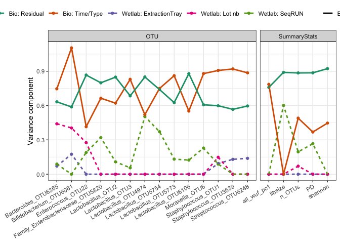

Figure S4 + S5
--------------

Post-hoc correlations between unweighted (S4) and weighted (S5) UniFrac
Principal Coordinates 1-3 and genus-level relative abundances. Only
values above 0.25 or below -0.25 are shown. **Here just as one figure**.

    MBvagdevtrans_genus <- tax_glom(MBvagdevtrans, taxrank = 'Genus')
    MBvagdevtrans_genus_ra <- transform_sample_counts(MBvagdevtrans_genus, function(OTU) OTU/sum(OTU))  
    OTUgenus <- MBvagdevtrans_genus_ra %>% otu_table() %>% t()

    getcorr <- function(x){
      r <- cor(x$ra,x$score) %>% tidy
      res <- data.frame(meanrelabu = mean(x$ra),presence = sum(x$ra>0) / length(x$ra), r = r$x)
      return(res)
    }
    XX <- cbind(sample_data(MBvagdevtrans_genus_ra), OTUgenus) %>% 
      gather(otu,ra,Coprococcus_OTU107:Shuttleworthia_OTU472) %>% 
      gather(component,score,all_uf_pc1:all_uf_pc3,all_wuf_pc1:all_wuf_pc3) %>% 
      group_by(component,otu) %>% 
      do(getcorr(x= .)) %>% 
      filter(abs(r)>0.25) 

    ggplot(data = XX, aes(otu,r)) + 
      geom_bar(stat = 'identity') + 
      geom_text(aes(y = 0.75,label = sprintf('%.2e',meanrelabu))) + 
      geom_text(aes(y = 0.85,label = sprintf('%.2f',presence))) + 
      facet_grid(component~., scales = 'free',  space = 'free') + 
      coord_flip() + theme_bw()

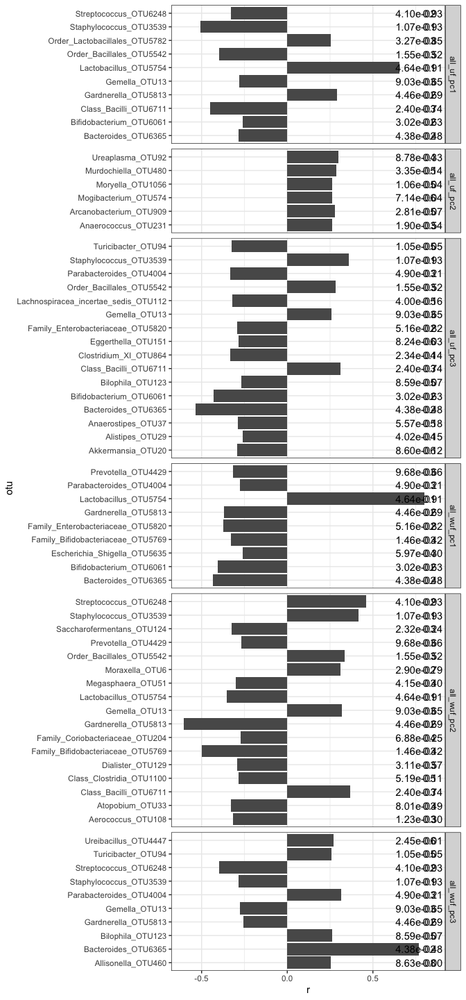

Figure S6
---------

Relative abundance of the top ten dominating Lactobacillus OTUs tested
for change during pregnancy.

    MBvagdevtrans %>% 
      subset_samples(Type=='V') %>% 
      rabuplot(phylo_ob = ., type = 'Species', 
               predictor = 'Time', select_taxa = 'Lactobacillus',
               select_type = 'genus', N_taxa = 10, no_other_type = T, 
               p_adjust = T)

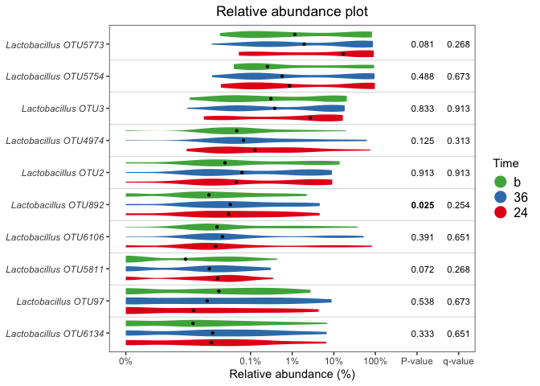

Figure S7 + S8
--------------
